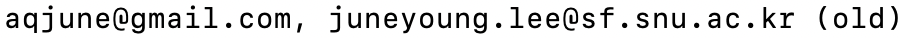

# Juneyoung Lee (이준영), Ph.D.

I'm a research engineer at [CryptoLab](https://www.cryptolab.co.kr/eng/),
a pioneering company for developing homomorphic encryption frameworks.

I received Ph.D. from [Software Foundations Lab](https://sf.snu.ac.kr/),
[Seoul National University](https://en.snu.ac.kr/) in August, 2021.
When I was a graduate student, I worked on clarifying the semantics of the intermediate
representation of [the LLVM compiler infrastructure](https://llvm.org) and
implementing compiler optimization validators.
I actively sent patches to LLVM
([commits](https://github.com/llvm/llvm-project/commits?author=aqjune)/[patches](https://reviews.llvm.org/differential/query/ZDmAEKkUFLzv/#R))
and participated in developing [Alive2](https://github.com/AliveToolkit/alive2) ([online](https://alive2.llvm.org/)), an automatic optimization validator ([pull requests](https://github.com/AliveToolkit/alive2/pulls?q=is%3Apr+author%3Aaqjune)).

## Education

- Ph.D. in Computer Science and Engineering, [Seoul National University](https://en.snu.ac.kr/) (2016. Mar ~ 2021. Aug)
  * Advisors: [Chung-Kil Hur](https://sf.snu.ac.kr/gil.hur/), [Nuno. P. Lopes](https://web.ist.utl.pt/nuno.lopes/).
  * Thesis: [A Validated Semantics for LLVM IR](https://sf.snu.ac.kr/juneyoung.lee/thesis/)

- B.S. in Computer Science and Engineering, minor in Life Science, [POSTECH](https://www.postech.ac.kr/eng/), magna cum laude (~ 2014. 8)

## Interests

- Programming languages, compiler verification (esp. _translation validation_)
- Theorem proving using SMT solvers and interactive theorem provers
- Homomorphic encryption (new!)

## Professional Activities

* Talk, "Undef and Poison: Present and Future", The 2020 Virtual LLVM Developers' Meeting, *Keynote Talk*  ([link](https://llvm.org/devmtg/2020-09/schedule/))
* Talk, "Safely Optimizing Casts between Pointers and Integers": 2019 European LLVM developers' meeting, Student Research Competition, Second Prize
- Artifact Evaluation Committee, CAV 2020

## Industrial Experience

- Sep, 2021 ~ now: Research engineer, CryptoLab.
  * I'm serving a mandatory military service by working for this company as well (~ Aug, 2022).
  * If you are interested in working for CryptoLab, please feel free to send a mail to me!
- May ~ Aug, 2019 : Intern, Program Analysis Team at Apple (Cupertino).
- Feb ~ Apr, 2018 : Research intern, Programming Principles and Tools Group at Microsoft Research (Cambridge, UK).

## Awards and Honors

- 2021 College of Engineering, SNU, Best Thesis Award
- 2019 European LLVM developers' meeting, Student Research Competition, Second Prize
- 2017 Mar – 2021. Aug. Graduate Student Scholarship. Korea Foundation for Advanced Studies.
- 2012 ACM International Collegiate Programming Contest (ICPC) Regional Contest Daejeon, 5th place (team name DIPLOMATICS, [link](http://icpckorea.org/2012-daejeon/regional))

## Publications

- Go to [the publications page](/publications.md)
